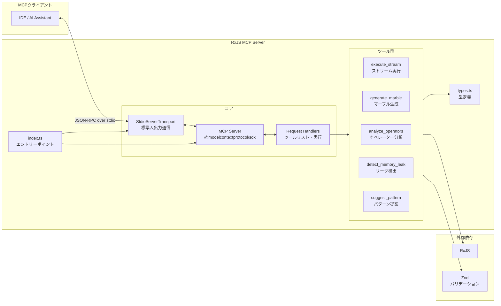
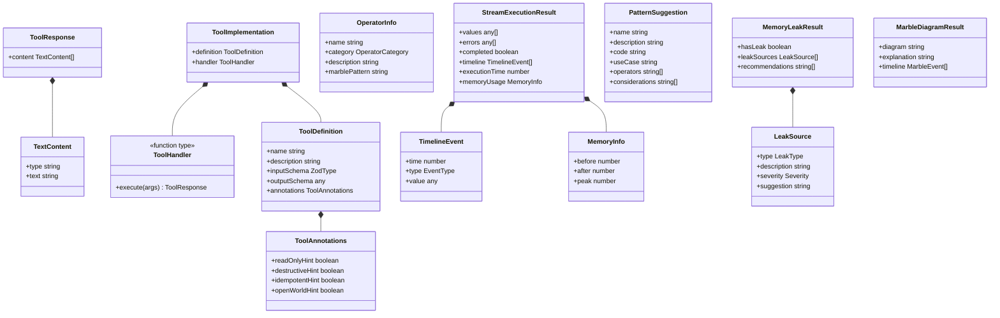
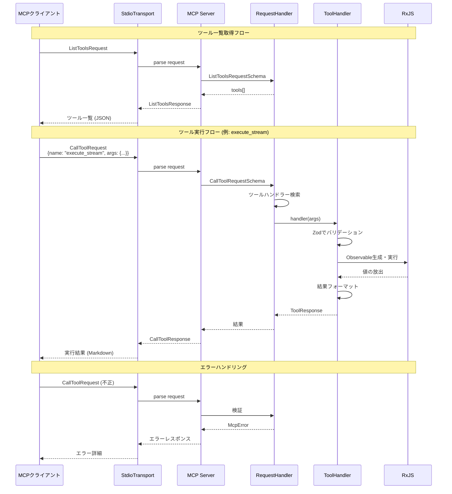
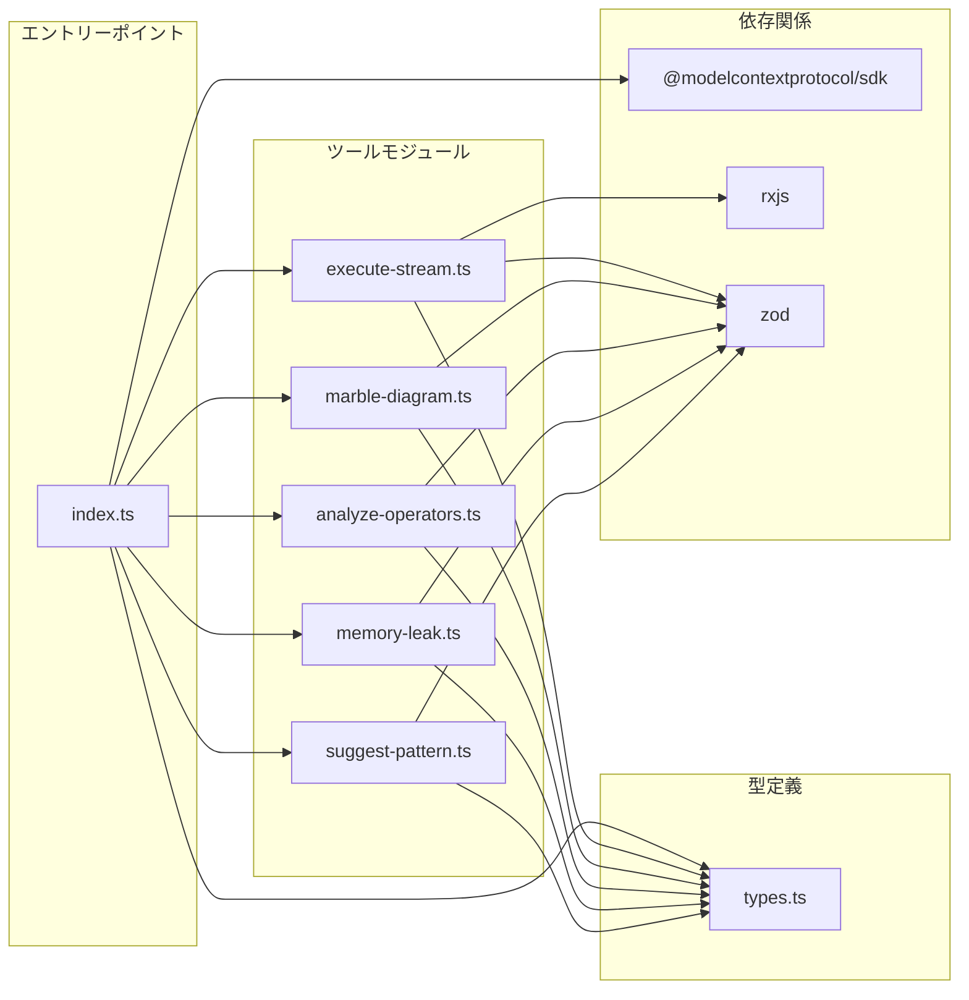
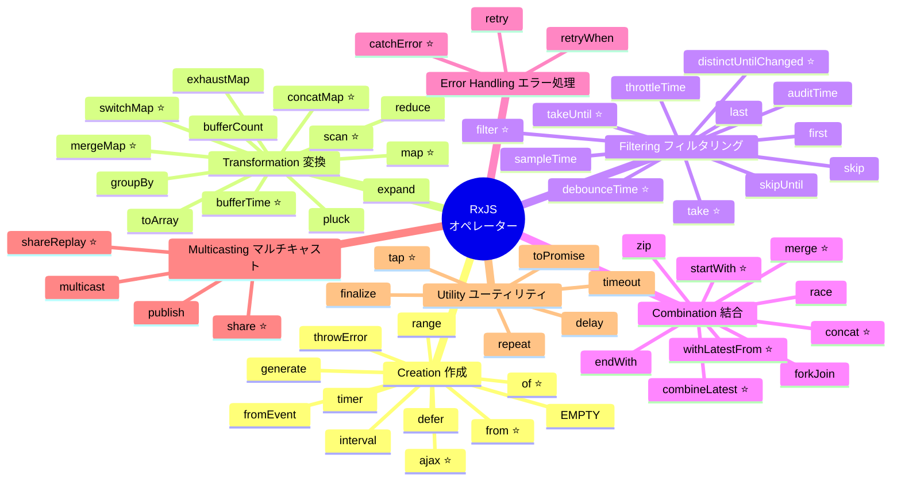
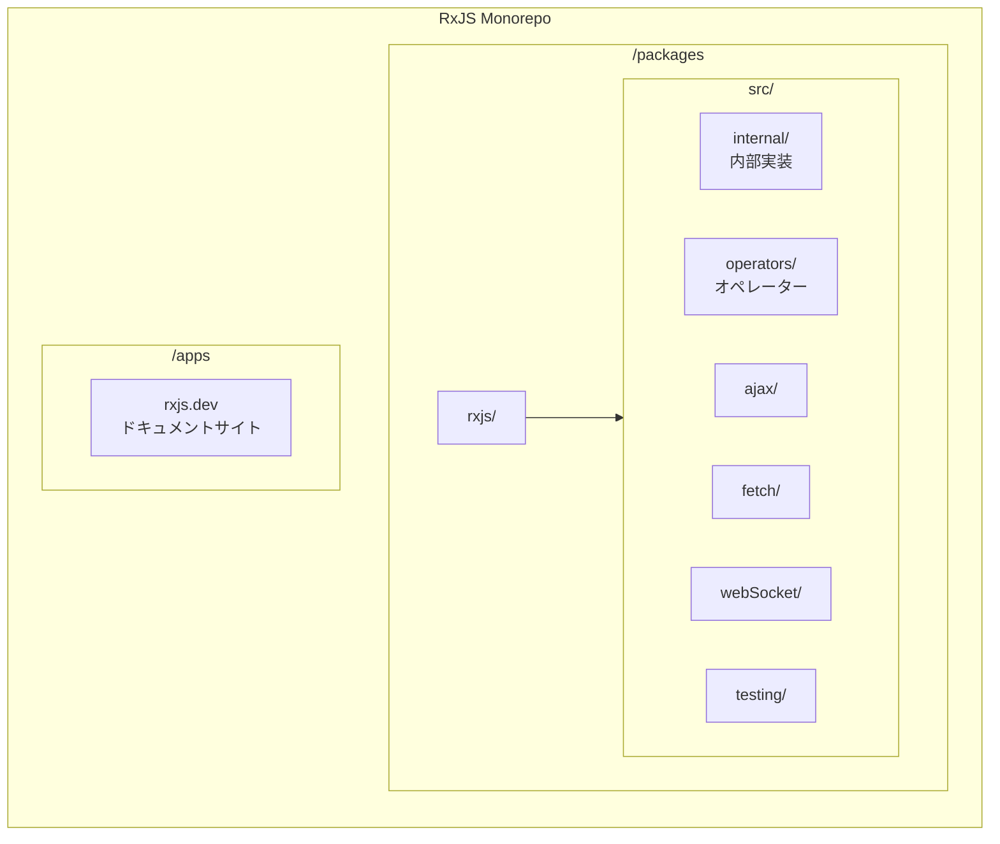
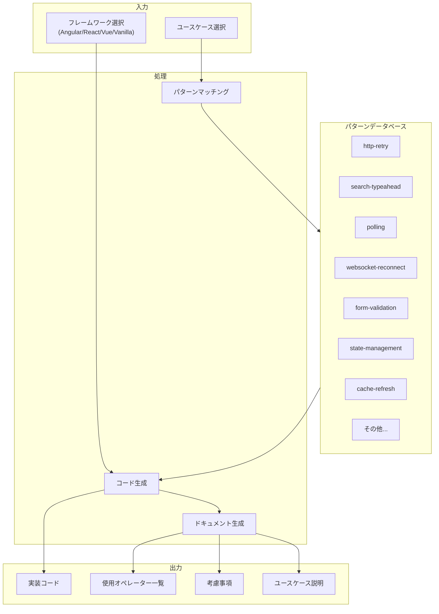

# RxJS MCP Server ファイル構成

## 📁 プロジェクト構造

```
rxjs-mcp-server/
├── package.json          # プロジェクト設定・依存関係定義
├── tsconfig.json        # TypeScript設定
├── README.md           # プロジェクトドキュメント（英語）
├── LICENSE             # MITライセンス
├── src/                # ソースコード
│   ├── index.ts        # メインエントリーポイント
│   ├── types.ts        # 共通型定義
│   └── tools/          # MCPツール実装
│       ├── execute-stream.ts     # ストリーム実行ツール
│       ├── marble-diagram.ts     # マーブルダイアグラム生成
│       ├── analyze-operators.ts  # オペレーター分析
│       ├── memory-leak.ts        # メモリリーク検出
│       └── suggest-pattern.ts    # パターン提案
├── dist/               # ビルド成果物（自動生成）
│   ├── index.js        # コンパイル済みメインファイル
│   ├── index.js.map    # ソースマップ
│   ├── index.d.ts     # 型定義ファイル
│   ├── types.js        # コンパイル済み型定義
│   └── tools/          # コンパイル済みツール
│       ├── execute-stream.js
│       ├── marble-diagram.js
│       ├── analyze-operators.js
│       ├── memory-leak.js
│       └── suggest-pattern.js
└── node_modules/       # 依存パッケージ（npm install後）
```

## 📊 アーキテクチャ図

### 全体構成図



### 型・インターフェース関係図（クラス図）



> **型の補足:**
> - `EventType`: `"next"` | `"error"` | `"complete"`
> - `LeakType`: `"subscription"` | `"subject"` | `"operator"`
> - `Severity`: `"low"` | `"medium"` | `"high"`
> - `OperatorCategory`: `"creation"` | `"transformation"` | `"filtering"` | `"combination"` | `"utility"` | `"error-handling"` | `"multicasting"`

### ツール実行シーケンス図



### コンポーネント関係図



### オペレーターカテゴリ構成図

> 参考: [Learn RxJS - Operators](https://www.learnrxjs.io/learn-rxjs/operators) / [RxJS公式リポジトリ](https://github.com/ReactiveX/rxjs)



> ⭐ は頻繁に使用されるオペレーターを示しています

### RxJS リポジトリ構造

> 参考: [ReactiveX/rxjs](https://github.com/ReactiveX/rxjs)



### パターン提案のデータフロー



## 📄 主要ファイルの説明

### 設定ファイル

#### `package.json`
プロジェクトのメタデータと設定を管理
- **name**: `@shuji-bonji/rxjs-mcp` - パッケージ名
- **version**: `0.1.0` - 現在のバージョン
- **dependencies**: 実行時に必要なパッケージ
  - `@modelcontextprotocol/sdk` - MCP SDK
  - `rxjs` - RxJSライブラリ
  - `zod` - スキーマバリデーション
- **devDependencies**: 開発時に必要なパッケージ
  - `typescript` - TypeScriptコンパイラ
  - `tsx` - TypeScript実行環境
  - `@types/node` - Node.js型定義
- **scripts**: npm スクリプト
  - `build` - TypeScriptをコンパイル
  - `dev` - 開発モード（ホットリロード）
  - `test` - MCP Inspectorでテスト
  - `clean` - ビルド成果物を削除

#### `tsconfig.json`
TypeScriptコンパイラの設定
- **target**: ES2022 - 出力するJavaScriptのバージョン
- **module**: Node16 - モジュールシステム
- **strict**: true - 厳格な型チェック有効
- **outDir**: ./dist - 出力ディレクトリ
- **rootDir**: ./src - ソースディレクトリ

### ソースコード（src/）

#### `index.ts`
MCPサーバーのメインエントリーポイント
- サーバーインスタンスの初期化
- ツールの登録と管理
- リクエストハンドラーの設定
- stdio通信の確立
- グレースフルシャットダウンの処理

主な責務：
1. MCPサーバーの起動
2. ツールリストの提供
3. ツール実行のルーティング
4. エラーハンドリング

#### `types.ts`
プロジェクト全体で使用する型定義
- `ToolResponse` - ツールレスポンスの構造
- `ToolHandler` - ツールハンドラー関数の型
- `ToolDefinition` - ツール定義の構造
- `ToolImplementation` - ツール実装の構造
- `StreamExecutionResult` - ストリーム実行結果
- `PatternSuggestion` - パターン提案の構造
- `MemoryLeakResult` - メモリリーク検出結果
- `MarbleDiagramResult` - マーブルダイアグラム結果
- `OperatorInfo` - オペレーター情報

### ツール実装（src/tools/）

#### `execute-stream.ts`
**RxJSストリーム実行ツール**

主な機能：
- RxJSコードの動的実行
- ストリームの値をキャプチャ
- タイムライン記録
- メモリ使用量の測定
- エラーハンドリング

入力パラメータ：
- `code` - 実行するRxJSコード
- `takeCount` - 取得する最大値数
- `timeout` - タイムアウト時間（ミリ秒）
- `captureTimeline` - タイムライン記録の有無
- `captureMemory` - メモリ使用量記録の有無

#### `marble-diagram.ts`
**マーブルダイアグラム生成ツール**

主な機能：
- ASCIIマーブルダイアグラムの生成
- イベントの時系列可視化
- パターン分析（規則的/不規則的な間隔）
- 値のマッピングと凡例生成

入力パラメータ：
- `events` - イベント配列（時間、値、タイプ）
- `duration` - 表示する総時間
- `scale` - 時間スケール（ms/文字）
- `showValues` - 値の表示有無

出力形式：
```
--A--B--C--D--|
Values:
  A = 1
  B = 2
  C = 3
  D = 4
```

#### `analyze-operators.ts`
**オペレーターチェーン分析ツール**

主な機能：
- オペレーターの抽出と分類
- パフォーマンス問題の検出
- 代替アプローチの提案
- ベストプラクティスのチェック

検出する問題：
- 複数のflatteningオペレーター
- map + filter の非効率な組み合わせ
- shareReplayの不適切な使用
- エラーハンドリングの欠如
- クリーンアップの欠如

オペレーターデータベース：
- 作成系（of, from, interval等）
- 変換系（map, switchMap, scan等）
- フィルター系（filter, take, debounceTime等）
- 結合系（merge, concat, zip等）
- ユーティリティ系（tap, delay, timeout等）
- エラーハンドリング系（catchError, retry等）

#### `memory-leak.ts`
**メモリリーク検出ツール**

主な機能：
- unsubscribeされていないサブスクリプション検出
- 無限ストリームの検出（interval, timer）
- 未完了のSubject検出
- fromEventのリスナーリーク検出
- フレームワーク固有の問題検出

フレームワーク対応：
- **Angular**: ngOnDestroy、async pipeのチェック
- **React**: useEffectクリーンアップのチェック
- **Vue**: beforeUnmount/onBeforeUnmountのチェック

重要度レベル：
- 🔴 **high** - 確実にリークする問題
- 🟡 **medium** - リークの可能性がある問題
- 🟢 **low** - パフォーマンスへの影響が小さい問題

#### `suggest-pattern.ts`
**RxJSパターン提案ツール**

利用可能なパターン：
1. **http-retry** - HTTPリトライ（指数バックオフ）
2. **search-typeahead** - 検索入力（デバウンス付き）
3. **polling** - スマートポーリング
4. **websocket-reconnect** - WebSocket自動再接続
5. **form-validation** - リアクティブフォーム検証
6. **state-management** - シンプルな状態管理
7. **cache-refresh** - キャッシュとリフレッシュ
8. **drag-drop** - ドラッグ＆ドロップ
9. **infinite-scroll** - 無限スクロール
10. **auto-save** - 自動保存
11. **rate-limiting** - レート制限
12. **error-recovery** - エラーリカバリ
13. **loading-states** - ローディング状態管理
14. **data-sync** - データ同期
15. **event-aggregation** - イベント集約

各パターンには以下が含まれます：
- 実装コード（フレームワーク別）
- 使用するオペレーター一覧
- 重要な考慮事項
- ユースケースの説明

### ビルド成果物（dist/）

TypeScriptコンパイル後に生成される実行可能なJavaScriptファイル群：
- `.js` - 実行可能なJavaScriptコード
- `.js.map` - デバッグ用ソースマップ
- `.d.ts` - TypeScript型定義（他のプロジェクトから利用時）
- `.d.ts.map` - 型定義のソースマップ

## 🔧 開発フロー

### 1. セットアップ
```bash
# リポジトリのクローン
git clone https://github.com/shuji-bonji/rxjs-mcp-server
cd rxjs-mcp-server

# 依存関係のインストール
npm install
```

### 2. 開発
```bash
# 開発モード（ファイル監視＋自動再起動）
npm run dev

# TypeScriptのビルド
npm run build

# ビルド成果物のクリーン
npm run clean
```

### 3. テスト
```bash
# MCP Inspectorでのテスト
npm test

# または直接実行
npx @modelcontextprotocol/inspector dist/index.js
```

### 4. デプロイ準備
```bash
# プロダクションビルド
npm run build

# パッケージ公開準備
npm pack
```

## 📦 パッケージ構成

### 公開されるファイル
`package.json`の`files`フィールドで定義：
- `dist/` - コンパイル済みJavaScriptコード
- `README.md` - ドキュメント
- `LICENSE` - ライセンスファイル

### 除外されるファイル
- `src/` - TypeScriptソースコード（型定義は含まれる）
- `node_modules/` - 依存パッケージ
- `*.test.ts` - テストファイル
- 設定ファイル（.gitignore, .npmignore等）

## 🎯 設計思想

### モジュール性
各ツールは独立したモジュールとして実装され、以下の構造を持ちます：
1. **入力スキーマ** - Zodによる厳密な型定義
2. **処理ロジック** - 単一責任の原則に従った実装
3. **出力フォーマット** - 一貫したMarkdown形式

### 拡張性
新しいツールの追加が容易：
1. `src/tools/`に新しいツールファイルを作成
2. `ToolImplementation`インターフェースを実装
3. `index.ts`でツールを登録

### 型安全性
TypeScriptとZodを使用した完全な型安全性：
- コンパイル時の型チェック
- ランタイムでのスキーマバリデーション
- 型定義ファイルの自動生成

## 🚀 今後の拡張予定

1. **追加ツール**
   - ストリームのビジュアライゼーション
   - カスタムオペレーターの作成支援
   - パフォーマンスプロファイリング

2. **統合機能**
   - Angular MCPとの連携
   - TypeScript MCPとの統合
   - Meta-MCPサポート

3. **開発者体験の向上**
   - VSCode拡張機能
   - インタラクティブなプレイグラウンド
   - より詳細なドキュメント

## 📝 貢献ガイドライン

1. **新機能の追加**
   - Issueで議論
   - フィーチャーブランチで開発
   - テストの追加
   - プルリクエストの作成

2. **バグ修正**
   - Issueの報告
   - 最小限の再現コード
   - 修正とテスト
   - プルリクエスト

3. **ドキュメント改善**
   - README.mdの更新
   - コード内コメントの追加
   - 使用例の追加
