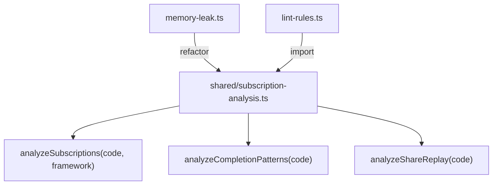
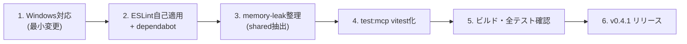

# v0.4.1 Chore / Refactor 計画

> レビュー指摘の未対応4件 + 追加改善をまとめたパッチリリース

## Issue テンプレート

```markdown
## v0.4.1: コード品質・CI/DX 改善

v0.4.0 のコードレビューで指摘された以下の項目を対応する。

### タスクリスト

- [ ] `memory-leak` と `lint_rxjs` の検出ロジック重複整理
- [ ] `getWorkerPath()` の Windows 対応
- [ ] ESLint 自己適用 + dependabot 追加
- [ ] `test-mcp-server.mjs` の vitest 化
```

---

## 1. `memory-leak` と `lint_rxjs` の検出ロジック重複整理

### 現状の問題

- `memory-leak.ts` の subscribe/unsubscribe 単純カウント比較は、Angular 16+ の `takeUntilDestroyed()` や `AsyncPipe` を誤検出する
- `lint_rxjs` の `no-ignored-replay-buffer` と `memory-leak.ts` の `shareReplay without refCount` が重複
- 2つのツールが独立に正規表現を組み立てており DRY でない

### 実装方針



1. **`src/shared/subscription-analysis.ts` を新設**
   - subscribe/unsubscribe カウントに加え、以下の「完了パターン」を認識:
     - `takeUntil(destroy$)` / `takeUntilDestroyed()`
     - `take(N)` / `first()`
     - `| async` (Angular async pipe)
     - `useEffect` + return cleanup (React)
     - `onUnmounted` (Vue)
   - `lint_rxjs` のフレームワークルールからもこの共有関数を呼ぶ

2. **`memory-leak.ts` のリファクタ**
   - `analyzeSubscriptions()` を呼び、フレームワーク対応の完了パターンを認識
   - `takeUntilDestroyed()` 使用時は false positive を出さない
   - severity の調整: 完了パターンなし→high, 部分的にあり→medium

3. **重複排除マッピング**

   | チェック | memory-leak | lint_rxjs | 統合先 |
   |----------|:-----------:|:---------:|--------|
   | subscribe vs unsubscribe count | ✅ | ❌ | memory-leak (固有) |
   | shareReplay without refCount | ✅ | ✅ | shared → 両方から利用 |
   | fromEvent without takeUntil | ✅ | ❌ | memory-leak (固有) |
   | nested subscribe | ❌ | ✅ | lint_rxjs (固有) |
   | Observable.create | ❌ | ✅ | lint_rxjs (固有) |

### 影響範囲

- `src/tools/memory-leak.ts` — リファクタ
- `src/tools/memory-leak.test.ts` — テスト追加（takeUntilDestroyed で false positive が出ないこと）
- `src/shared/subscription-analysis.ts` — 新規
- `src/data/lint-rules.ts` — framework ルールから shared 呼び出し（optional）

---

## 2. `getWorkerPath()` の Windows 対応

### 現状の問題

```typescript
// execute-stream.ts:20
if (__dirname.includes('/src/')) {
```

Windows では `C:\Users\foo\src\tools` のように `\` 区切りになるため、`/src/` が一致しない。

### 実装方針

```typescript
import path from 'node:path';

function getWorkerPath(): string {
  // path.sep を考慮: Windows は '\', POSIX は '/'
  const srcSegment = `${path.sep}src${path.sep}`;
  if (__dirname.includes(srcSegment)) {
    return path.resolve(__dirname, '..', '..', 'dist', 'tools', 'execute-stream-worker.js');
  }
  return path.join(__dirname, 'execute-stream-worker.js');
}
```

### テスト

- 既存の `execute-stream.test.ts` が通ればOK（POSIX 環境のテスト）
- Windows CI を追加するなら `ci.yml` の matrix に `os: [ubuntu-latest, windows-latest]` を追加（optional、vitest の rolldown が Windows で動くか確認必要）

### 影響範囲

- `src/tools/execute-stream.ts` — 1関数の修正

---

## 3. ESLint 自己適用 + dependabot 追加

### ESLint 自己適用

Lint ツールを提供するプロジェクト自身が lint されていないのは説得力に欠ける。

**セットアップ:**

```bash
npm install -D eslint @eslint/js typescript-eslint eslint-plugin-rxjs-x
```

**`eslint.config.js`:**

```javascript
import eslint from '@eslint/js';
import tseslint from 'typescript-eslint';
import rxjsX from 'eslint-plugin-rxjs-x';

export default tseslint.config(
  eslint.configs.recommended,
  ...tseslint.configs.recommended,
  rxjsX.configs.recommended,
  {
    rules: {
      '@typescript-eslint/no-explicit-any': 'error',
      '@typescript-eslint/no-unused-vars': ['error', { argsIgnorePattern: '^_' }],
    },
  },
  {
    ignores: ['dist/', 'node_modules/', '*.mjs'],
  },
);
```

**`package.json` scripts:**

```json
{
  "scripts": {
    "lint": "eslint src/",
    "lint:fix": "eslint src/ --fix"
  }
}
```

**CI 追加 (`ci.yml`):**

```yaml
- name: Lint
  run: npm run lint
```

### Dependabot

**`.github/dependabot.yml`:**

```yaml
version: 2
updates:
  - package-ecosystem: "npm"
    directory: "/"
    schedule:
      interval: "weekly"
    groups:
      dev-dependencies:
        dependency-type: "development"
      production-dependencies:
        dependency-type: "production"
    open-pull-requests-limit: 5
  - package-ecosystem: "github-actions"
    directory: "/"
    schedule:
      interval: "monthly"
```

### 影響範囲

- `eslint.config.js` — 新規
- `package.json` — devDependencies 追加 + scripts 追加
- `.github/dependabot.yml` — 新規
- `.github/workflows/ci.yml` — lint step 追加
- **ソースコード修正**: ESLint で検出されるエラーを修正（主に `any` 型）

---

## 4. `test-mcp-server.mjs` の vitest 化

### 現状の問題

- `test-mcp-server.mjs` は独立した手動スクリプトで vitest に組み込まれていない
- `npm test` で実行されないため CI で自動検知できない
- `npm run test:mcp` は別コマンドとして存在するが、`npm test` で一括実行されない

### 実装方針

**`src/tools/mcp-integration.test.ts` として再実装:**

```typescript
import { describe, it, expect, beforeAll, afterAll } from 'vitest';
import { spawn, ChildProcess } from 'node:child_process';
import path from 'node:path';

describe('MCP Server Integration', () => {
  let serverProcess: ChildProcess;
  let sendRequest: (method: string, params?: unknown) => Promise<unknown>;

  beforeAll(async () => {
    // Spawn server process
    const serverPath = path.resolve(__dirname, '../../dist/index.js');
    serverProcess = spawn('node', [serverPath], { stdio: ['pipe', 'pipe', 'pipe'] });
    
    // Setup JSON-RPC communication
    sendRequest = createJsonRpcClient(serverProcess);
    
    // Initialize
    await sendRequest('initialize', {
      protocolVersion: '2024-11-05',
      capabilities: {},
      clientInfo: { name: 'vitest-client', version: '1.0.0' },
    });
  });

  afterAll(() => {
    serverProcess?.kill();
  });

  it('should list all 6 tools', async () => {
    const result = await sendRequest('tools/list', {});
    expect(result.tools).toHaveLength(6);
    expect(result.tools.map(t => t.name)).toContain('lint_rxjs');
  });

  it('should execute lint_rxjs', async () => {
    const result = await sendRequest('tools/call', {
      name: 'lint_rxjs',
      arguments: { code: "import { map } from 'rxjs/operators';" },
    });
    expect(result.content[0].text).toContain('prefer-root-operators');
  });

  // ... 既存テストの移植
});
```

**移行戦略:**

1. `src/tools/mcp-integration.test.ts` を新規作成
2. `test-mcp-server.mjs` の全テストケースを移植
3. 既存の `test-mcp-server.mjs` は互換性のため残す（`test:mcp:legacy` に rename）
4. `npm test` で integration test も含めて実行される

**注意点:**

- Integration test は Worker spawn するため遅い → vitest の `test.sequential` を使用
- ビルド済みであることが前提 → `beforeAll` でビルド確認 or `vitest.config.ts` で globalSetup

### 影響範囲

- `src/tools/mcp-integration.test.ts` — 新規
- `package.json` — `test:mcp` script の更新
- `test-mcp-server.mjs` — 保持（legacy として）

---

## 実装順序



### 見積もり

| タスク | 工数 | リスク |
|--------|------|--------|
| Windows 対応 | 5分 | 低 |
| ESLint 自己適用 | 30分 | 中（既存コードの any 修正が波及） |
| dependabot | 5分 | 低 |
| memory-leak 整理 | 1時間 | 中（テスト追加が主） |
| test:mcp vitest化 | 45分 | 中（子プロセス通信のテスト安定性） |

---

## リリースチェックリスト

- [ ] 全テスト通過 (`npm test`)
- [ ] MCP integration test 通過 (`npm run test:mcp`)
- [ ] ESLint 通過 (`npm run lint`)
- [ ] ビルド通過 (`npm run build`)
- [ ] CHANGELOG.md に v0.4.1 セクション追加
- [ ] package.json version → 0.4.1
- [ ] git tag v0.4.1 → push → GitHub Actions で自動 publish
